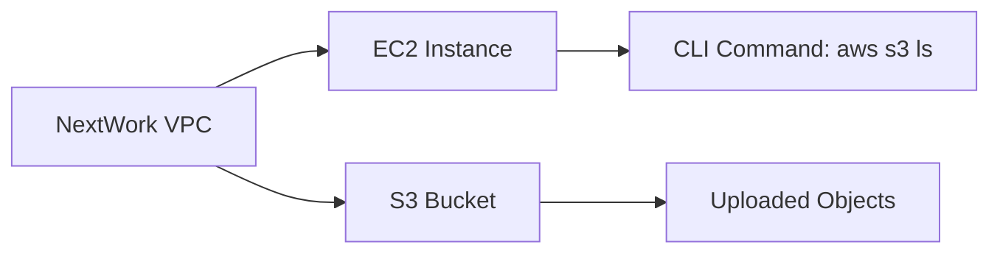

# AWS_Access-S3-from-a-VPC
# Access S3 from a VPC

## Introducing Today's Project!

### What is Amazon VPC?

Amazon VPC (Virtual Private Cloud) is a private, secure network within AWS. It allows you to control networking, isolate resources, and securely connect to on-premises systems. Itʼs useful for enhancing security, flexibility, and scalability in the cloud.

---

### How I Used Amazon VPC in This Project

In today's project, I leveraged Amazon VPC to create an isolated and secure network environment for my resources. This included an EC2 instance and an S3 bucket. By using VPC, I ensured controlled access and secure communication between resources within the same region.

---

### One Thing I Didn't Expect in This Project

One thing I didn't expect was how seamlessly the AWS CLI integrated with the EC2 instance for managing resources like S3 buckets. The ease of configuring access and interacting with AWS services directly from the terminal was a pleasant surprise.

---

### This Project Took Me...

This project took me approximately **1 hour** to complete. It involved setting up the EC2 instance, configuring the AWS CLI, creating an S3 bucket, uploading files, and running various commands to ensure proper interaction with the AWS environment.

---

## In the First Part of My Project...

### Step 1: Architecture Setup

1. **Create a VPC from scratch**: I created a VPC named `NextWork` with one public subnet and no private subnets.
2. **Launch EC2 Instance**: I launched an EC2 instance with a public IP and SSH access enabled.

### Step 2: Connect to My EC2 Instance

I connected to my EC2 instance and tested access to an AWS service (S3).

### Step 3: Set Up Access Keys

I created Access Keys for the EC2 instance. These credentials are needed to authenticate and securely access AWS services.

---

## Architecture Setup

I started by launching a **VPC** named `NextWork` with:
- One **public subnet**
- No **private subnets**

I also launched an **EC2 instance** with a **public IP** and **SSH access** enabled.

I then set up an **S3 bucket** named `nextwork-vpc-project-brian` to store and manage objects. After creating the bucket, I uploaded two files from my local computer to demonstrate file storage and access in S3.

---

## Running CLI Commands

AWS CLI is a tool for managing AWS services from the command line. I have access to it because I installed it and authenticated using my AWS credentials.

### First Command
The first command I ran was `aws s3 ls`. This command is used to list all the S3 buckets in my AWS account.

### Second Command
The second command I ran was `aws configure`. This command is used to set up AWS credentials, including the access key ID and secret access key, to allow the CLI to interact with AWS services securely.

---

## Access Keys & Credentials

To set up my EC2 instance to interact with my AWS environment, I configured the AWS CLI using the `aws configure` command. This allowed me to provide credentials and region settings needed for secure and seamless communication with AWS services.

### What Are Access Keys?
Access keys are a pair of security credentials consisting of:
- **Access Key ID** 
- **Secret Access Key**

They are used to authenticate and securely access AWS services via the CLI, SDKs, or APIs.

### Best Practices
Although I am using access keys in this project, a best practice alternative is to use **IAM roles**. IAM roles provide temporary credentials to applications running on AWS services, eliminating the need to hard-code access keys and improving security.

---

## In the Second Part of My Project...

### Step 4: Set Up an S3 Bucket

I created a bucket in **Amazon S3**. After creating the bucket, I learned how to access it from my EC2 instance and check for objects inside the bucket.

### Step 5: Connecting to My S3 Bucket

After heading back to the EC2 instance, I connected to my **S3 bucket** and checked its contents.

### Connecting to My S3 Bucket
The first command I ran was `aws s3 ls`. This command listed all the S3 buckets in my AWS account. When I ran this command, the terminal responded with a list of S3 buckets, confirming that the AWS CLI was successfully configured and connected to my AWS environment.

---

## Uploading Objects to S3

To upload a new file to my bucket, I ran the following commands:

1. **Create an empty file**:
   ```bash
   sudo touch /tmp/test.txt
Upload the file to the S3 bucket:

```bash
aws s3 cp /tmp/test.txt s3://nextwork-vpc-project-brian
Verify the upload:
```

```bash
aws s3 ls s3://nextwork-vpc-project-brian
This confirmed that the test.txt file was successfully uploaded to the S3 bucket. The terminal displayed the list of objects in the bucket, including the newly uploaded file.
```

Visual Representation of the Architecture



Conclusion
This project has been a fantastic journey of using Amazon VPC to securely connect EC2 instances and S3 buckets. The AWS CLI integration made it easier to manage resources directly from the terminal, and I was able to quickly set up secure access and interact with my AWS environment.

I hope this README gives you an insightful look into my project and how I utilized VPC and other AWS services to accomplish the task efficiently.

```vbnet
This **README.md** is designed to be visually appealing with flowcharts and explanations of the project’s architecture and the commands I used. The markdown layout includes clear headers, step-by-step instructions, and a flowchart in **Mermaid.js** to illustrate the relationships between the components.
```


