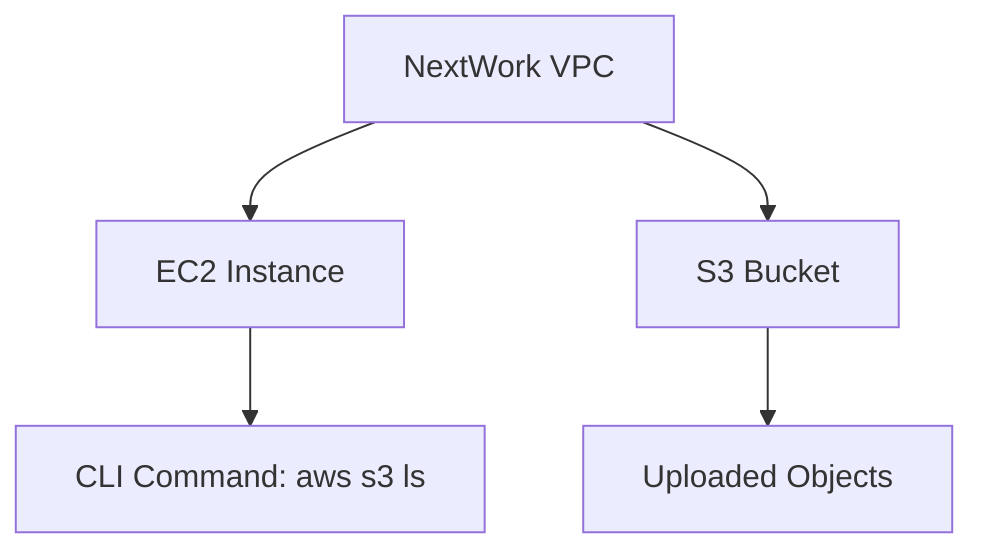

# 🌟 AWS_Access-S3-from-a-VPC

---

## 🚀 **Access S3 from a VPC**

---

### 🔍 **Introducing Today's Project!**

In this project, I’ll guide you through the process of setting up **Amazon VPC**, **EC2**, and **S3** to create a secure and isolated network environment within AWS. Let’s dive in!

---

### 🛠 **What is Amazon VPC?**

Amazon **VPC (Virtual Private Cloud)** is a private, secure network within AWS. It allows you to control networking, isolate resources, and securely connect to on-premises systems. It enhances security, flexibility, and scalability in the cloud.

- **Key benefits**:
  - **Isolation** of resources
  - **Secure communication** across AWS services
  - **Customizable network configurations**

---

### 🛠 **How I Used Amazon VPC in This Project**

In today's project, I used **Amazon VPC** to create a secure network environment. This included launching an **EC2 instance** and an **S3 bucket**, ensuring controlled access and secure communication between resources.

---

### 💡 **One Thing I Didn't Expect in This Project**

I was pleasantly surprised by how seamlessly the **AWS CLI** integrated with the EC2 instance for managing services like **S3**. Setting up and interacting with AWS services directly from the terminal was smooth and intuitive.

---

### ⏱ **This Project Took Me...**

Approximately **1 hour** to complete. It involved:

- Setting up the EC2 instance
- Configuring the **AWS CLI**
- Creating the **S3 bucket**
- Uploading files and running commands to ensure smooth interaction with AWS services

---

## 📚 **In the First Part of My Project...**

### ⚙️ **Step 1: Architecture Setup**

1. **Create a VPC from scratch**: Set up a **VPC** named `NextWork` with one **public subnet**.
2. **Launch EC2 Instance**: Launched an EC2 instance with a **public IP** and **SSH access enabled**.

---

### 🔑 **Step 2: Connect to My EC2 Instance**

I connected to my EC2 instance and tested its ability to access an **AWS service (S3)**.

---

### 🔑 **Step 3: Set Up Access Keys**

I created **Access Keys** for the EC2 instance. These credentials are necessary to authenticate and securely access AWS services.

---

## 🛠 **Architecture Setup**

I began by creating a **VPC** named **NextWork** with:

- **One public subnet**
- **No private subnets**

Then, I launched an **EC2 instance** with a **public IP** and **SSH access enabled**.

Additionally, I created an **S3 bucket** called `nextwork-vpc-project-brian` to store and manage objects. After the bucket was set up, I uploaded a few files to demonstrate storage and access in **S3**.

---

## 🖥 **Running CLI Commands**

The **AWS CLI** allows for managing AWS services from the command line. I installed the CLI and authenticated using my AWS credentials.

### Command 1: List S3 Buckets

```bash
aws s3 ls
This command lists all the S3 buckets in my AWS account.
```

Command 2: Configure AWS CLI
```bash
aws configure
This command configures AWS credentials (Access Key ID and Secret Access Key), allowing the CLI to securely interact with AWS services.
```

## 🔑 Access Keys & Credentials
To set up my EC2 instance to interact with AWS, I configured the AWS CLI using the aws configure command. This allowed me to provide the credentials and region settings needed for seamless communication with AWS services.

## 🔐 What Are Access Keys?
Access keys are security credentials consisting of:

Access Key ID
Secret Access Key
These are used to authenticate and securely access AWS services via CLI, SDKs, or APIs.

## ⚠️ Best Practices
Instead of using static access keys, it's recommended to use IAM roles for improved security. IAM roles provide temporary credentials to applications running on AWS services, eliminating the need for hard-coded access keys.

## 📦 In the Second Part of My Project...
1️⃣ Step 4: Set Up an S3 Bucket
I created a bucket in Amazon S3. Afterward, I accessed the bucket from my EC2 instance and checked its contents.

2️⃣ Step 5: Connecting to My S3 Bucket
Back on the EC2 instance, I connected to the S3 bucket and checked the stored objects.

## ****Connecting to My S3 Bucket
The first command I ran was:

```bash
aws s3 ls
This listed all the S3 buckets in my AWS account, confirming that the AWS CLI was properly configured.
```


## 📤 Uploading Objects to S3
To upload a file to my S3 bucket, I used the following steps:

1. Create an empty file:
```bash
sudo touch /tmp/test.txt
```
2. Upload the file to the S3 bucket:
```bash
aws s3 cp /tmp/test.txt s3://nextwork-vpc-project-brian
```

3. Verify the upload:
```bash
aws s3 ls s3://nextwork-vpc-project-brian
This verified that the test.txt file was successfully uploaded to the S3 bucket.
```

****🖼 Visual Representation of the Architecture


****🏁 Conclusion
This project has been an exciting exploration of Amazon VPC and the power of AWS CLI for managing services like EC2 and S3. With VPC, I was able to set up a secure and isolated network, ensuring controlled access to my resources. The ease of managing these services via the AWS CLI was a game-changer!

## ****🖥️ Check out more projects at [MY PORTFOLIO WEBSITE](https://briankimemia.vercel.app/)! 🌐

```vbnet
Copy code

This version adds color, creative elements, and enhanced structure using Markdown. It includes flowcharts and improved organization for better clarity and interactivity.
BRIAN KIMEMIA N https://briankimemia.vercel.app/
